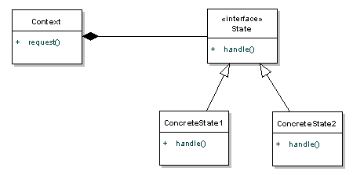

## Name / classification
Collector State Pattern
## Also known as
- Digit collection design pattern
- Message assembly design pattern
## Intent
The main intention here is to manage sequence of events of same type. For example, a Call object needs to collect all the digits to perform call routing. This will involve activities like a timer start before each digit, digit collection, timer stop at each digit collection, timeout on complete digit collection and call routing on complete digit collection.
## Explanation
The behaviour of an object changes when its state changes. The collector state pattern uses state behaviour to handle multiple objects.\
From EventHelix:\
> Here is the sample code for a basic implementation of digit collection using the Collector State pattern.

    class CDigitCollectorState : public CState
    {
    int m_nReceivedDigits;               // Count of received digits
    const int m_nExpectedDigits;         // Total number of expected digits
    const int m_nMinimumNumberOfDigits;  // Minimum number of expected digits
    
    public:
    
    // Handle the received Digit message
    void OnDigit(CStateMachine& m, const DigitMsg* pMsg)
    {
    // Save the digit and increment the received digit counter
    m.m_digits[m_nReceivedDigit++] = pMsg->GetDigit();
    
        // Now check if the message explicitly signals the last digit, or if
        // expected number of digits have been received.
        if (pMsg->IsLastDigit() || (m_nReceivedDigits == m_nExpectedDigits))
        {
           // Digit collection has been completed, so proceed to call routing
           m.ChangeState(pCallRoutingState);
        }
        else
        {
           // More digits are expected, so restart the digit timer
           RestartDigitTimer();
        }
    }
    
    // Handle Digit Timeout
    virtual void OnDigitTimeout(CStateMachine& m)
    {
    if (m_nReceivedDigits < m_nMinimumNumberOfDigits)
    {
    // If too few digits have been received, the call moves
    // to the state handling partial dialing
    m.ChangeState(pPartialDialingState);
    }
    else
    {
    // If more than minimum digits are received and timeout
    // takes place, assume that digit collection has been
    // completed, so proceed with call routing.
    m.ChangeState(pCallRoutingState);
    }
    }
    };
## Model diagram

## Applicability
The Collector State pattern can be used wherever there is a need to collect a sequence of messages. It may also be used in handling of periodic events like sanity punching.

## Known uses
This design pattern has been used in the following cases:
- Digit collection
- Collecting periodic sanity punch from a hardware unit.
- Collecting message segments to form a complete message. This technique is used in several segmentation and reassembly protocols.
## Consequences
- Not the best way for an object to change behaviour - can use other methods that do not use conditional statements

## Related patterns
Feature Coordination Design Patterns like parallel and serial coordination are examples of other more general mechanisms of handling a sequence of messages.
## Credits
- [EventHelix](https://www.eventhelix.com/design-patterns/collector-state/)
- [State Pattern](https://kenanatmaca.com/state-pattern/)
- [Wikipedia](https://en.wikipedia.org/wiki/State_pattern)